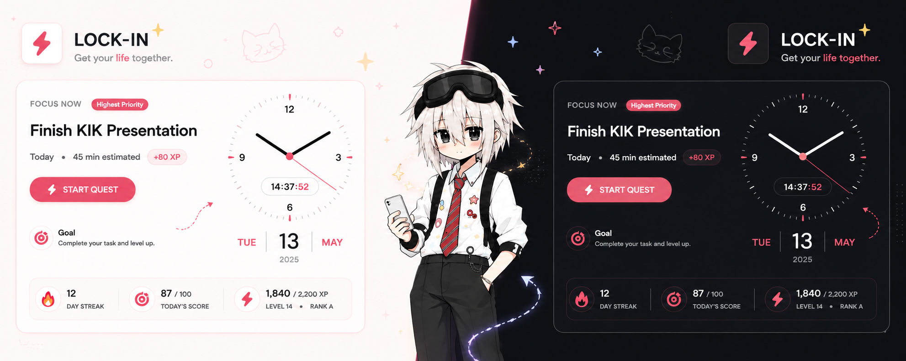

<div align="center">

# ⚡ LOCK-IN
### Gamified Productivity & Focus RPG Platform

[](https://react.dev/)
[](https://www.typescriptlang.org/)
[](https://tailwindcss.com/)
[](https://vitejs.dev/)

</div>

---

## 📌 Overview

**LOCK-IN** is a sleek, modern productivity application designed to turn daily task management into an engaging RPG experience. Combining real-time focus sessions, gamified XP leveling, minimalist wristwatch HUDs, and habit analytics, LOCK-IN keeps you locked in on what matters most.

---

## ✨ Key Features

- ⌚ **Minimalist Luxury Watch-Face & Date HUD**: Real-time analog wristwatch clock with smooth sweep hands, dial numbers, embedded digital time capsule, and luxury date formatting (`THU | 13 | AUG / 2026`).
- ⚡ **RPG Focus Sessions**: Timestamp-based focus mode with quest targeting, real-time audio cues, level-up celebrations, and XP rewards.
- 🔥 **Horizontal 7-Day Streak Calendar**: Live weekly streak tracker with fire emoji indicators for active streak days.
- 🎯 **Smart Priority Engine**: Algorithmic quest priority scoring (`isHighestPriority`) automatically highlighting your most urgent task in the **Focus Now** hero card.
- 🌙 **Production-Grade Dual Theme System**: Seamless instant toggle between Warm Pastel Light Mode and Sleek Minimal Dark Mode via CSS variables.
- 📝 **Persistent Quick Notes Drawer**: Expandable floating notes panel accessible across every page with local persistence.
- 💻 **OS Username Integration**: Automatically detects and greets the active Windows / macOS / Linux system user (`GOOD MORNING, Kidung.`).

---

## 🛠️ Technology Stack

| Layer | Technology |
| :--- | :--- |
| **Framework** | [React 19](https://react.dev/) (Functional Components & Hooks) |
| **Language** | [TypeScript 6](https://www.typescriptlang.org/) (Strict Type Definitions) |
| **Build System** | [Vite 8](https://vitejs.dev/) (Lightning-fast HMR & Production Bundling) |
| **Styling** | [Tailwind CSS v4](https://tailwindcss.com/) + CSS Variables Design System |
| **Icons & Visuals** | [Lucide React](https://lucide.dev/), Canvas Confetti, Custom SVG Vector Doodles |

---

## 🚀 Getting Started

### Prerequisites

- **Node.js**: v18.0.0 or higher
- **Package Manager**: `pnpm` (recommended), `npm`, or `yarn`

### Installation & Run

1. **Clone the repository**:
   ```bash
   git clone https://github.com/YourUsername/Lock-in.git
   cd Lock-in
   ```

2. **Install dependencies**:
   ```bash
   pnpm install
   ```

3. **Start local development server**:
   ```bash
   pnpm run dev
   ```
   Open `http://localhost:5173` in your browser.

4. **Build for production**:
   ```bash
   pnpm run build
   ```

---

## 📁 Project Architecture

```
Lock-in/
├── src/
│   ├── assets/              # Banners, mascot illustrations, and brand assets
│   ├── components/
│   │   ├── common/          # Reusable UI (WatchFace, FocusNowCard, StreakCalendar, Badge)
│   │   ├── layout/          # Layout wrappers (Header, Sidebar, QuickNotesDrawer)
│   │   └── views/           # Page views (Dashboard, Quests, Focus, Habits, Skills, Progress)
│   ├── constants/           # Initial state data & achievement definitions
│   ├── context/             # AppContext global state provider & theme manager
│   ├── types/               # TypeScript interface schemas (UserProfile, Quest, Skill)
│   └── utils/               # Helper utilities (getOSUsername, priority calculator, sound)
├── vite.config.ts           # Vite build configuration & OS username define
└── package.json             # Project dependencies & scripts
```

---

<div align="center">
  <sub>Built with ❤️ for focused productivity.</sub>
</div>
